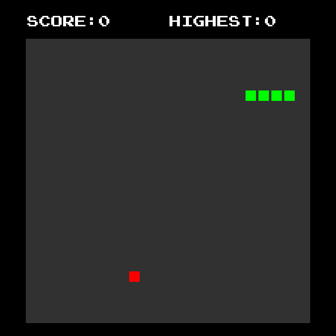

# Snake

A Snake game in C using SDL2.



## Requirements

Arch Linux:
- gcc
- cmake
- make
- sdl2
- sdl2_ttf

## Compiling and Running

```console
$ echo Release > scripts/config.txt
$ scripts/build.sh
$ scripts/run.sh
```

## Controls

- **ESC**: quit
- P: toggle pause
- **Arrow keys**: movement
